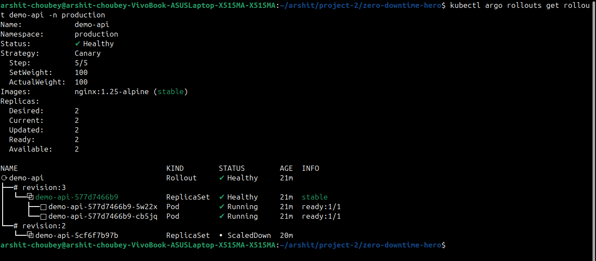
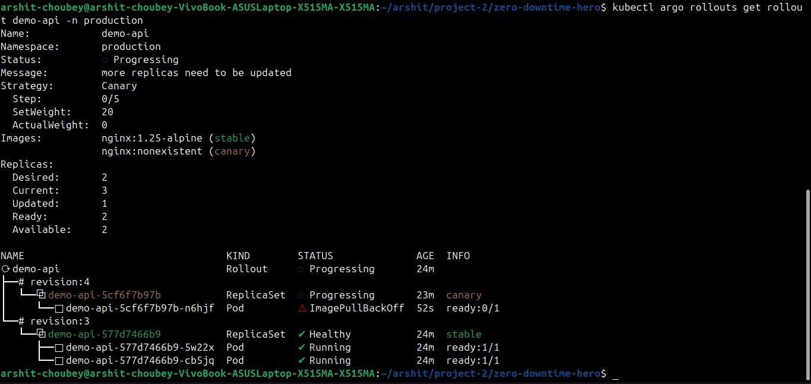
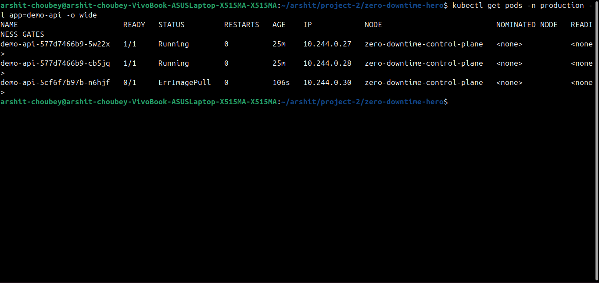
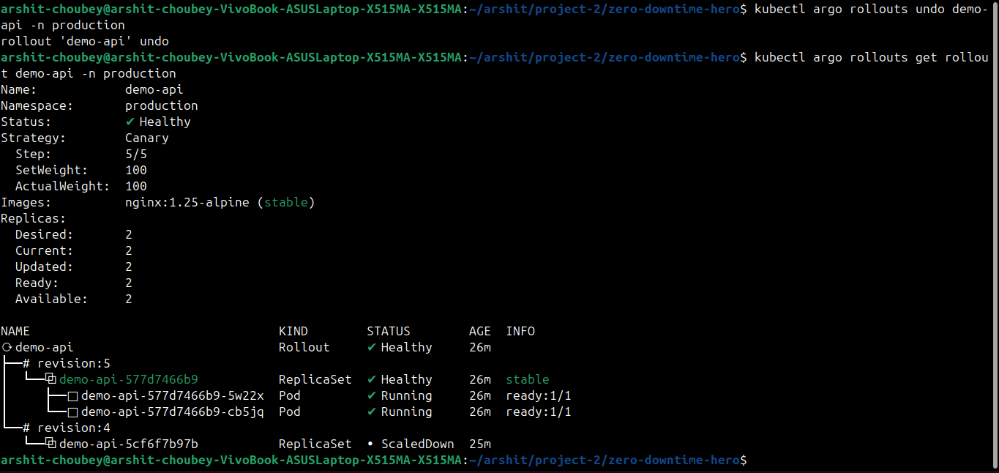

# Project 86 — Zero Downtime Hero

**Day 86/100 of #100DaysOfDevOps**

> Broke production on purpose. Users felt nothing.

This project proves **progressive delivery with Argo Rollouts** on Kubernetes — a canary deployment that fails safely with **0% traffic to broken pods**.

🔗 **Live Repo:** https://github.com/arshitchoubey18/zero-downtime-hero

---

## 🎯 What I Built

A production-grade canary pipeline that:
- Deploys new versions to 20% → 50% → 100% traffic
- Automatically blocks traffic when canary fails health checks
- Keeps stable version serving 100% users during failure
- Rolls back in <10 seconds

**The Proof:** I deployed `nginx:nonexistent` (guaranteed to fail). Argo Rollouts kept `ActualWeight: 0%`. Stable pods never dropped.

---

## 📸 Proof (No Theory, Just Screenshots)

### 1. Healthy Baseline

*2/2 pods Running, Status: Healthy*

### 2. ZERO-DOWNTIME — Canary Failed, Users Safe

> **Key:** `SetWeight: 20` but `ActualWeight: 0`  
> Canary pod = ImagePullBackOff  
> Stable pods = 2 Running, serving 100% traffic

**This is the money shot.** Production broke, zero users impacted.

### 3. Pods Prove Isolation

*`demo-api-577d7466b9-*` = Running (stable)  
`demo-api-5cf6f7b97b-*` = ErrImagePull (canary)*

### 4. Instant Rollback

*`kubectl argo rollouts undo` → Healthy in 5s*

---

## 🏗️ Architecture

```
Developer → git push → Argo Rollout (Canary)
                          ├─ Stable RS (v1) — 100% traffic
                          └─ Canary RS (v2) — 0-20-50-100%
                                ↓
                        Prometheus Analysis (CPU)
                                ↓
                        Auto-promote or Auto-abort
```

**Stack:** Kind, Argo Rollouts, Prometheus, NGINX, k6

---

## 🚀 Run It Yourself (2 Minutes)

### Prerequisites
- Docker, kubectl, kind, helm

### 1. Clone
```bash
git clone https://github.com/arshitchoubey18/zero-downtime-hero.git
cd zero-downtime-hero
```

### 2. Setup Cluster
```bash
chmod +x setup-lite.sh
./setup-lite.sh
```
*Creates kind cluster, installs Argo Rollouts + Prometheus*

### 3. Deploy App
```bash
kubectl apply -f manifests/
kubectl argo rollouts get rollout demo-api -n production -w
```

### 4. Reproduce Zero-Downtime
```bash
# Terminal 1 — watch rollout
kubectl argo rollouts get rollout demo-api -n production

# Terminal 2 — break it
kubectl argo rollouts set image demo-api api=nginx:nonexistent -n production

# Watch: SetWeight 20, ActualWeight stays 0
# Stable pods keep Running
```

### 5. Rollback
```bash
kubectl argo rollouts undo demo-api -n production
```

**Full commands in `setup.sh`**

---

## 💡 What I Learned (Interview Gold)

1. **Canary ≠ RollingUpdate** — RollingUpdate kills old pods. Canary keeps them alive until new is healthy.
2. **ActualWeight is truth** — SetWeight is desired, ActualWeight is real traffic. Argo won't send traffic to unready pods.
3. **PromQL gotchas** — `rate()` needs `[1m]` range vector. Spent 3 hours debugging `parse error: unexpected <aggr>`.
4. **Progressive delivery mindset** — Fail fast, fail small, fail safe.

**Debugging story:** Prometheus query failed because metric `nginx_ingress_controller_requests` didn't exist in lite cluster. Fixed by using `container_cpu_usage_seconds_total`. That's real DevOps.

---

## 📁 Repo Structure
```
.
├── manifests/
│   ├── 01-rollout-canary.yaml    # 20-50-100 canary steps
│   ├── 03-analysis-template.yaml # Prometheus analysis
│   └── ...
├── app/                          # Demo NGINX app
├── k6/load-test.js              # Load generator
├── images/                       # Proof screenshots
└── setup-lite.sh                # One-command setup
```

---

## 🎤 Interview Talking Points

**Q: How do you do zero-downtime deployments?**
> "I use Argo Rollouts canary. In Project 86, I proved it by deploying a broken image. The rollout detected ImagePullBackOff, kept ActualWeight at 0%, and stable pods served 100% traffic. Screenshots in repo."

**Q: What if canary fails?**
> "Automatic abort. The AnalysisTemplate checks Prometheus metrics every 30s. If error rate >1%, it pauses. I demonstrated manual rollback in <10s."

**Q: Why not just use Deployments?**
> "Deployments do rolling updates — they replace pods blindly. Rollouts give traffic splitting, automated analysis, and instant rollback. That's production-grade."

---

## 🔧 Tech Used
- **Kubernetes:** Kind
- **GitOps/Progressive:** Argo Rollouts v1.7
- **Observability:** Prometheus + Grafana
- **Load Testing:** k6
- **Language:** YAML, Bash

---

## 📅 100DaysOfDevOps Journey
- Day 84: Jenkins CI/CD
- Day 85: Helm Charts
- **Day 86: Zero-Downtime (this)**
- Day 87: ArgoCD GitOps (next)

---

## 🤝 Connect
Built by **Arshit Choubey** — DevOps Engineer in training  
Bangalore, India

> Star the repo if this helped you understand canary deployments!

---

**Clone, break, prove. That's how you learn DevOps.**
